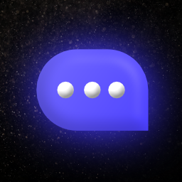

<div align="center">


# modchat-vue

> The next generation cross-platform client for Modchat

      [](https://buymeacoffee.com/micahlt)


  
## What is Modchat?
Modchat is a moderated chat webapp designed for creators on [Scratch](https://scratch.mit.edu/).  The primary goal is to create a center to hang out, work on projects, and meet new people all while following Scratch's [Community Guidelines](https://scratch.mit.edu/community_guidelines).  Since Scratch is designed for children, all images and text must be moderated very strictly.  The user interface should be accessible and easy to navigate.  

This repository holds the frontend code, which is a dynamic Vue 3 application built with JavaScript and CSS.  The backend (which you'll probably want for developing this) can be found at [micahlt/modchat-server](https://github.com/micahlt/modchat-server).  The project follows the [all-contributors specification](https://allcontributors.org/docs/en/specification).  

## Project setup
### Install dependencies
```bash
$ npm install
```

### Compile and host server
```bash
$ npm run serve
```

### Build for production
```bash
$ npm run build
```

### Lint and fix files
```bash
$ npm run lint
```
</div>
